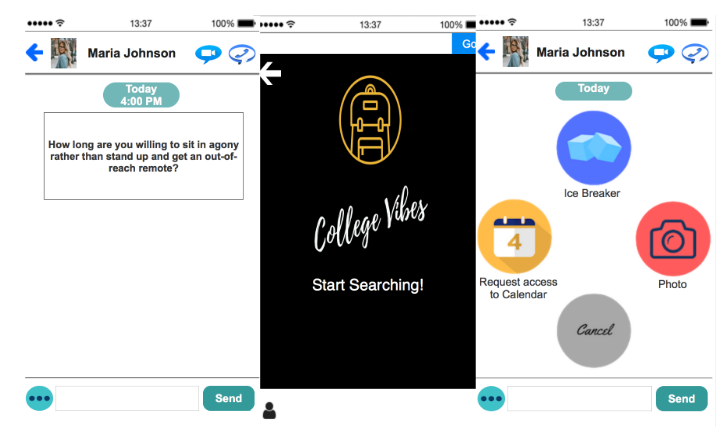

# CollegeVibes

  

**[View CollegeVibes](https://9te13l.axshare.com/?#g=1&p=home)**
  
**[View CollegeVibes Documentation](https://saharafathelbab.github.io/portfolio/documentation/CollegeVibes_Documentation/collegevibesinfo.html?)**

#### General Information

An application created in my Human Computer Interaction Course -
it is angled to assist freshman commuter students make friends and
meet like-minded people.

#### Technologies Used

* Storyboard
* Axure

#### Special Note:

My team and I received the highest grade for our project in this Human Computer Interaction Course.
