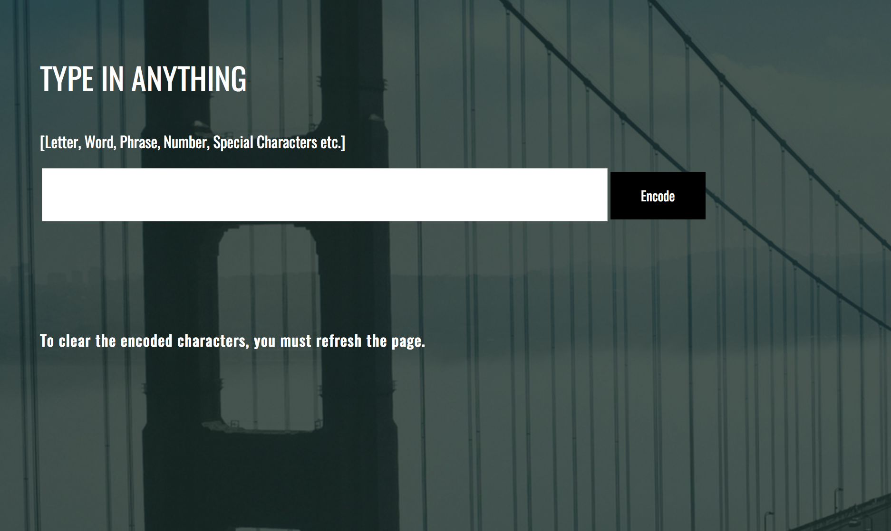

# Cryptography

  

**[View Cryptography Project](https://saharafathelbab.github.io/portfolio/documentation/Cryptography_Documentation/Cryptography/Cryptfun.html?)**
  
**[View Cryptography Project Documentation](https://saharafathelbab.github.io/portfolio/documentation/Cryptography_Documentation/CryptographyInfo.html?)**

#### General Information

Inspired by the book Code Girls, I developed my own Code & Cipher system. The aim of this Cryptography project
is for peers to communicate with a private key - the codebook I created. The encoded message is only able to be read
if a peer has the private key to decipher the message.

#### Technologies Used

* HTML & CSS
* JavaScript

#### Special Note:

The author of the book Code Girls reached out to tell me how thrilled she was to see that
her book prompted me to create my own code & cipher system.

