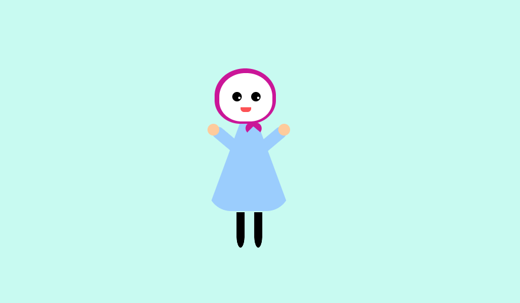

# CSS Shapes - Happy Hijabi

  

#### To View Happy Hijabi Live:
**[View Happy Hijabi](https://saharafathelbab.github.io/portfolio/documentation/Happy-Hijabi-Documentation/index.html?)**

#### General Information

Happy Hijabi was created as a way to grow more comfortable and to test creative limits in CSS.

#### Technologies Used

* HTML
* CSS

#### What I've learned

I learned how to utilize CSS to make specific shapes rather than only relying on A-Frame (based on three.js)
for making animations and having primitive shapes readily available. Unlike A-frame, there was no A-Frame Inspector
to move specific shapes on their axis to the position I intended them to be in - rather had to grow comfortable with
using <strong>transform: rotate(); </strong> and <strong>border-left,right,botttom, border-radius</strong> to make shapes.
