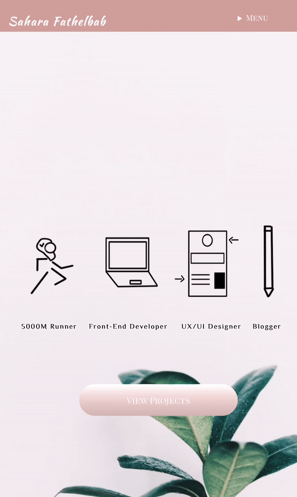

# My Portfolio

  

**[View Live](https://saharafathelbab.github.io/portfolio/)**

### Table of Contents
* [General Information](#general-information)
* [Technologies Used](#technologies-used)
* [Home Page](#Home-Page)
  * [Differences Between Home Page on Desktop vs Mobile](#Differences-Between-Home-Page-on-Desktop-vs-Mobile)
* [About Page](#About-Page)
* [Projects Page](#Projects-Page)
  * [Differences Between Projects Page on Desktop vs Mobile](#Differences-Between-Projects-Page-on-Desktop-vs-Mobile)
* [Documentation Page](#Documentation-Page)

#### General Information

As of November 2018, this portfolio was completed and deployed onto Github. As I grew as a Designer & Front-End Developer,
my previous portfolio design no longer reflected my skill-set. So, I decided to redesign & code my portfolio to better
reflect who I am.

#### Technologies Used

* Prototyped in Adobe XD
* Coded in HTML & CSS

#### Home Page

When I first began sketching the design, I knew I wanted words that best describe me to be front and center on the home page.
Those words are: 5000M Runner, Front-End Developer, UX/UI Designer, and Blogger.

##### Differences Between Home Page on Desktop vs Mobile

<b>Background Image:</b> For <i>Desktop viewing</i>, it is a landscape photo of a keyboard, pen, and a cup of tea being shown.
For <i>mobile viewing</i> it is a vertical image of a plant. 

<b>Navigation:</b> On <i>desktop</i>, the navigation bar has my name on the top left corner and the links to
my Projects, About Me, Blog, and Youtube Channel are spread out on the right hand side. On <i>mobile</i>,
my name remains on the top left corner however the links are encompassed in a drop down menu.

  

#### About Page

I opted for a simple design for this page where on Desktop the text would be on the lefthand side
and on the righthand side would be a photo of me. I decided to include socials, LinkedIn , Twitter ,
Youtube and my Email below my photo for easy access. 

On Mobile, my photo with my socials beneath are at the top of the page and the text is underneath.

#### Projects Page

One thing that was important to me was to have a small blurb/elevator pitch for each project prior
to someone viewing the project in its entirety. Without an elevator pitch a person would not know what
exactly they are clicking on. 

I decided to also have two buttons: View Documentation & View Project.

##### Differences Between Projects Page on Desktop vs Mobile

On Desktop, the user should be able to see an image relating to the project on the lefthand side
and it's accompanying elevator pitch on the righthand side. Below the elevator pitch there are the two buttons:
View Documentation & View Project. 

On mobile, the image relating to the project is above the elevator pitch and buttons.

  
  

#### Documentation Page

My aim with the Documentation Page was to present the problem that my project solves & how it solves it
and automatically give the option to view the project after reading that briefly. 

If someone would like to view the in depth research & documentation that accompanies the project,
they are able to press the down bar. The reason I made it optional to view the entire detailed documentation was
because a recruiter/employer only has a couple of minutes to glance at a portfolio. The aim was for a recruiter/employers
to understand the gist of the project instantly. 
